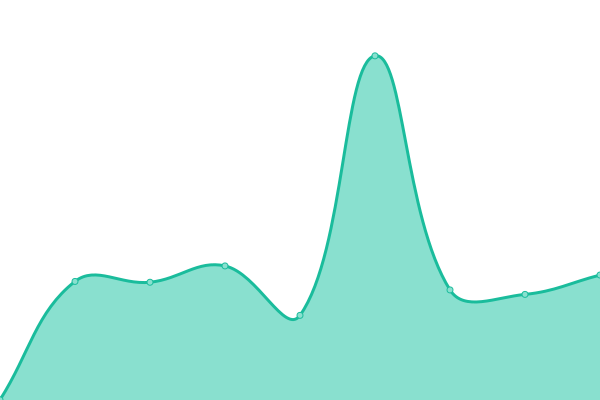

# [📈 Live Status](https://upptime.github.io/upptime): <!--live status--> **🟩 All systems operational**

This repository contains the open-source uptime monitor and status page for [Upptime](https://upptime.js.org), powered by [Upptime](https://github.com/upptime/upptime).

With [Upptime](https://upptime.js.org), you can get your own unlimited and free uptime monitor and status page, powered entirely by a GitHub repository. We use [Issues](https://github.com/upptime/upptime/issues) as incident reports, [Actions](https://github.com/glashtin/upptime/actions) as uptime monitors, and [Pages](https://upptime.github.io/upptime) for the status page.

<!--start: status pages-->
<!-- This summary is generated by Upptime (https://github.com/upptime/upptime) -->
<!-- Do not edit this manually, your changes will be overwritten -->
<!-- prettier-ignore -->
| URL | Status | History | Response Time | Uptime |
| --- | ------ | ------- | ------------- | ------ |
|  [Kith's Creations](https://kithcreations.com) | 🟩 Up | [kith-s-creations.yml](https://github.com/glashtin/uptime/commits/HEAD/history/kith-s-creations.yml) | 

 1656ms
     
 | 

<a href="https://glashtin.github.io/uptime/history/kith-s-creations">100.00%</a>
    

|  [Gennings Lawn](https://www.genningslawn.com) | 🟩 Up | [gennings-lawn.yml](https://github.com/glashtin/uptime/commits/HEAD/history/gennings-lawn.yml) | 

 2086ms
     
 | 

<a href="https://glashtin.github.io/uptime/history/gennings-lawn">100.00%</a>
    

|  [I Scoop for You](https://iscoopforyou.com) | 🟩 Up | [i-scoop-for-you.yml](https://github.com/glashtin/uptime/commits/HEAD/history/i-scoop-for-you.yml) | 

 130ms
     
 | 

<a href="https://glashtin.github.io/uptime/history/i-scoop-for-you">100.00%</a>
    

|  [I Scoop 4 You](https://iscoop4you.com) | 🟩 Up | [i-scoop-4-you.yml](https://github.com/glashtin/uptime/commits/HEAD/history/i-scoop-4-you.yml) | 

 229ms
     
 | 

<a href="https://glashtin.github.io/uptime/history/i-scoop-4-you">100.00%</a>
    

|  [M3 ToolBox](https://m3toolbox.com) | 🟩 Up | [m3-tool-box.yml](https://github.com/glashtin/uptime/commits/HEAD/history/m3-tool-box.yml) | 

 2711ms
     
 | 

<a href="https://glashtin.github.io/uptime/history/m3-tool-box">100.00%</a>
    

|  [Lifeway One Source](https://prospectservice.lifewaystores.com) | 🟩 Up | [lifeway-one-source.yml](https://github.com/glashtin/uptime/commits/HEAD/history/lifeway-one-source.yml) | 

 3189ms
     
 | 

<a href="https://glashtin.github.io/uptime/history/lifeway-one-source">100.00%</a>
    

|  [PMC](https://order.tpmco.com) | 🟩 Up | [pmc.yml](https://github.com/glashtin/uptime/commits/HEAD/history/pmc.yml) | 

 505ms
     
 | 

<a href="https://glashtin.github.io/uptime/history/pmc">99.92%</a>
    

|  [Lexinet Prints](https://lexinetprints.com) | 🟩 Up | [lexinet-prints.yml](https://github.com/glashtin/uptime/commits/HEAD/history/lexinet-prints.yml) | 

 1150ms
     
 | 

<a href="https://glashtin.github.io/uptime/history/lexinet-prints">100.00%</a>
    

|  [Agent Z Marketing](https://www.agentzmarketing.com) | 🟩 Up | [agent-z-marketing.yml](https://github.com/glashtin/uptime/commits/HEAD/history/agent-z-marketing.yml) | 

 535ms
     
 | 

<a href="https://glashtin.github.io/uptime/history/agent-z-marketing">99.81%</a>
    

<!--end: status pages-->

[**Visit our status website →**](https://upptime.github.io/upptime)

## 📄 License

- Powered by: [Upptime](https://github.com/upptime/upptime)
- Code: [MIT](./LICENSE) © [Upptime](https://upptime.js.org)
- Data in the `./history` directory: [Open Database License](https://opendatacommons.org/licenses/odbl/1-0/)
